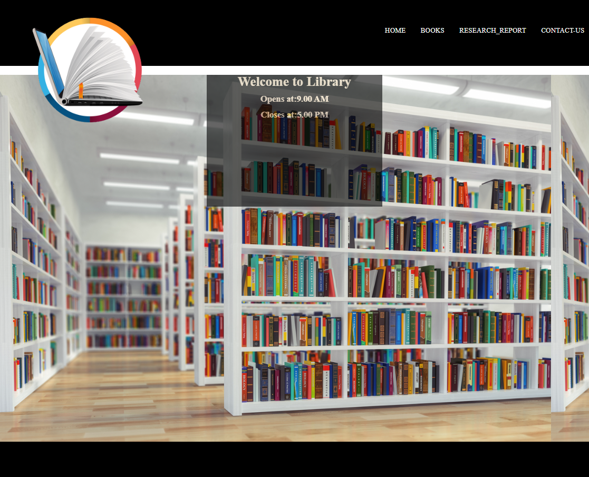
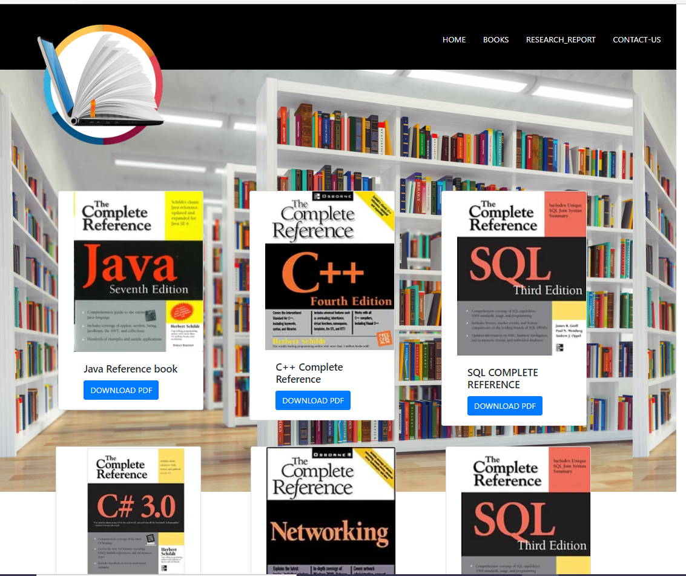
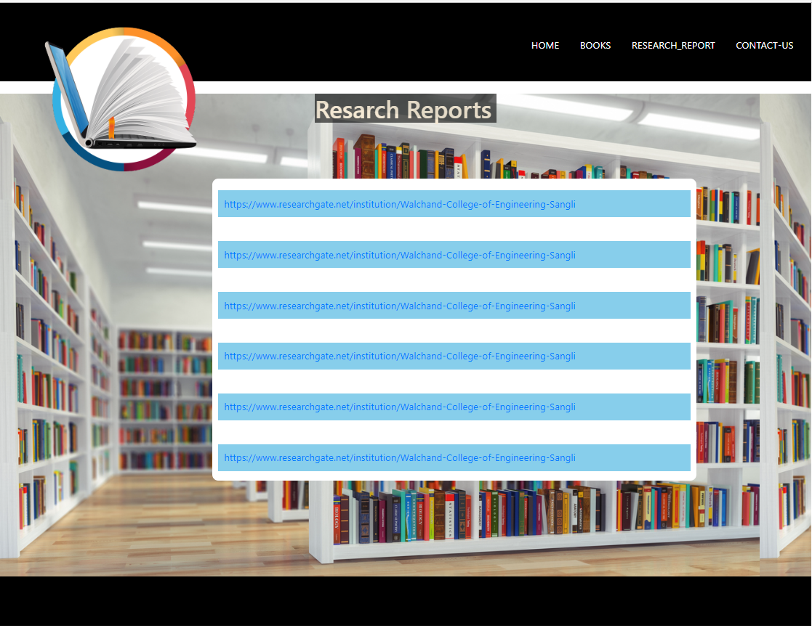
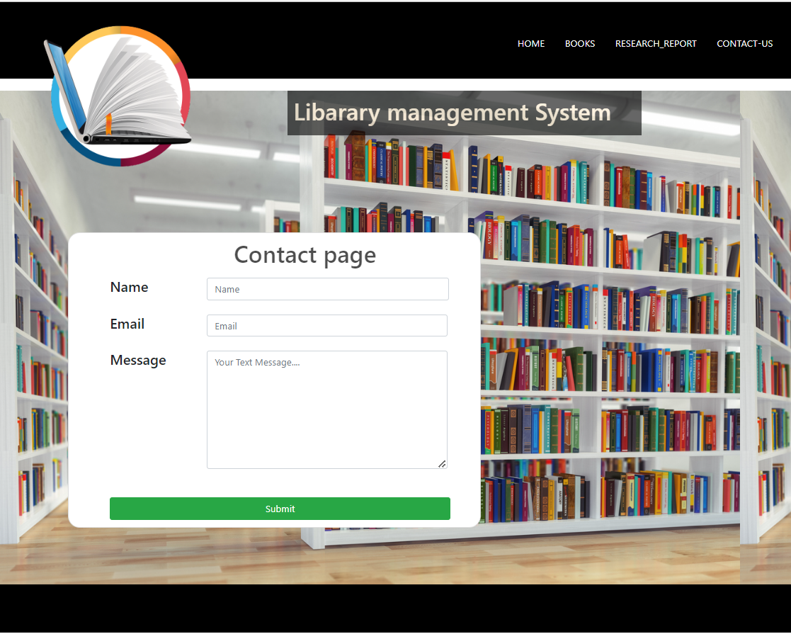

# FRT
Project for FRT

https://github.com/manojmore-523/frt

https://lemon-moss-028bf3d10.1.azurestaticapps.net

# ✨ Library Website  ✨

This is a web based application developed for a Library .

### This web based Library Website has been developed for the accomplishment of Future Ready Talent Internship program launched by Microsoft, Future Skills Prime, Quess, Github and EY.

**Project Link** (https://lemon-moss-028bf3d10.1.azurestaticapps.net)

**Demo Video** -  https://www.youtube.com/watch?v=cfh7dHVn8kU

## Features and Functionalities 😃

- Interactive and responsive UI.
- Has many graphical and visual innovative effects.
- Have an aesthetically pleasing visual design and architecture.
- Has collection of many web pages including Home, Book , Report, Contact .
- User is able to book a table through the website.

## Screenshots 📸
### Home page -   

### Books Page -

### Report page -

### Contact page -

## Tech Stack 💻

- [Azure(Hosting)](https://azure.microsoft.com/en-in/features/azure-portal/)
- HTML
- CSS

